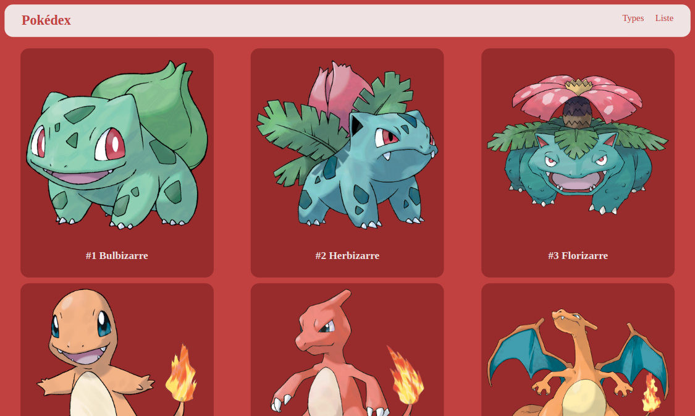
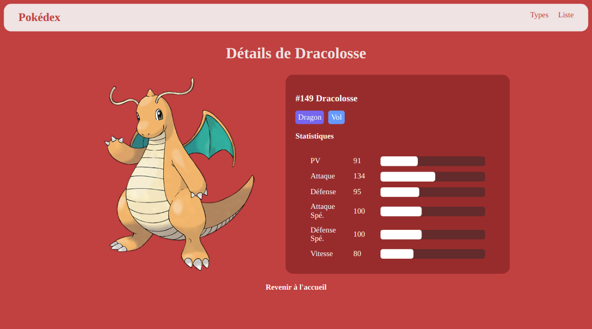
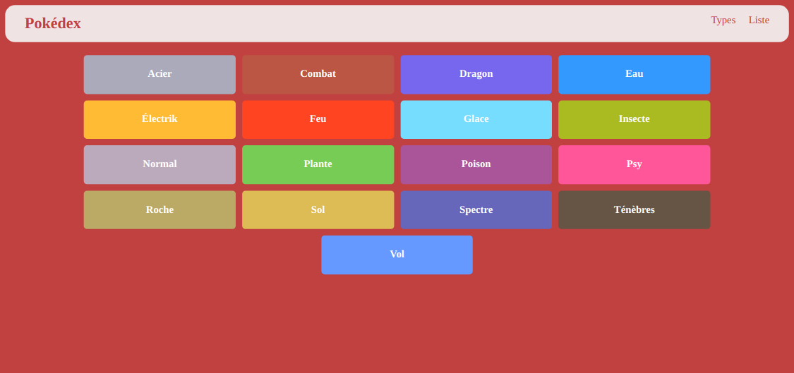
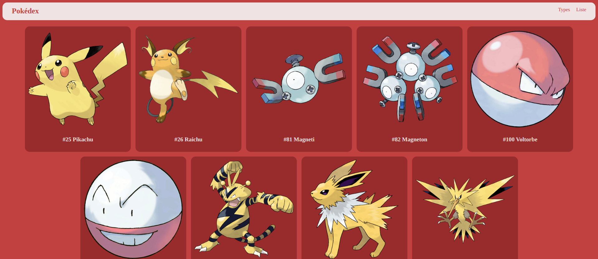

## Objectifs

Utiliser l'architecture MVC avec PHP dans son ensemble :

- Créer et mapper des routes dynamiques
- Créer et manipuler une base de données (Select uniquement)
- Passer des données aux vues via un controller

## Outils

- MVC
- PHP
- MySQL
- Adminer
- AltoRouter

## Brief

Créer un pokedex avec les pokemons de 1ère génération :

- Homepage = listing de tous les pokemons et redirection vers fiche détaillée
- Details = informations du pokemon (nom / statistiques (sur une base de 255) / type (redirection vers pokemons du même type))
- Types = listing de tous les types et redirection vers les pokemons de chaque type
- Type Listing = listing des pokemons du type selectionné

# Screenshots

